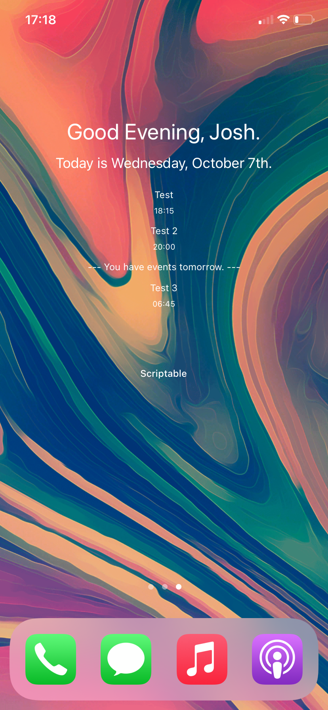

# Greetings Widget for Scriptable

Greetings Widget is a JS codebyte to be used in conjunction with the "Scriptable" App for iOS beta 14.2.

It will dynamically update your iPhone home screen with a handy dandy widget, displaying the date, and any events.

## Directions for Use

1. First, download the latest version of the application "Scriptable" for iOS 14.2.

2. Clone this repo to GitHub mobile. Copy the raw code into a new Scriptable Script.

3. Follow the on screen instructions, screenshotting your existing wallpaper in 'wiggle' mode.

4. Save the script as a new file within scriptable.

5. Add a new "scriptable" widget to your home screen.

6. In the scriptable widget settings, select your new file. 

## About & Acknowledgements

This code is kit bashed from a number of **far more** talented JS developers than I.

This code was originally forked from **_Seleo_**, who provides automatic font and text formatting.

Thank you to **_RiverWolf_**, for their time-dependent greeting mechanism.

Additional contributors include **mzeryck**, **Sharn25**, and **corderjones**. Thank you all.